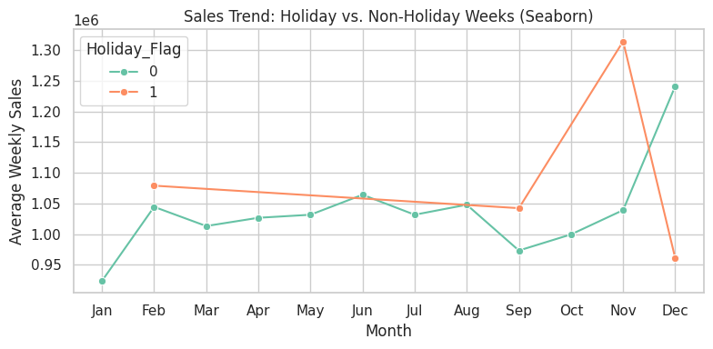

# Walmart Sales Analysis Report

## 1. Overview of the Dataset
The Walmart Sales dataset provides weekly sales data across various stores, along with key economic indicators such as fuel prices, consumer price index (CPI), and unemployment rates. It also flags whether a week is a holiday.

### Attributes Summary:
- **Store:** Unique identifier for each store.
- **Weekly_Sales:** Total sales for the store during the week.
- **Holiday_Flag:** Binary indicator (1 for holidays, 0 for non-holidays).
- **Temperature:** Average weekly temperature.
- **Fuel_Price:** Weekly average fuel price in USD.
- **CPI:** Consumer Price Index, measuring inflation.
- **Unemployment:** Weekly unemployment rate.
- **Day, Month, Year:** Temporal attributes for detailed analysis.

---

## 2. Data Exploration Plan
- Analyze the sales distribution and address any skewness or outliers.
- Evaluate the impact of holidays on sales trends.
- Explore the relationship between sales and economic indicators (e.g., CPI, unemployment).
- Examine seasonal trends and year-wise patterns.

---

## 3. Data Preparation and Cleaning
- **Missing Values:** No significant missing data was found.
- **Outlier Handling:** Retained rows where `Weekly_Sales` values are within three standard deviations.
- **Log Transformation:** Applied to `Weekly_Sales` to normalize the skewed distribution.
- **Feature Engineering:** Extracted `Day`, `Month`, and `Year` for enhanced temporal analysis.

---

## 4. Key Insights from Exploratory Data Analysis

### 4.1 Weekly Sales Distribution:
- The initial sales distribution was right-skewed. After log transformation, it approximated a normal distribution, facilitating better analysis and modeling.

### 4.2 Holiday vs. Non-Holiday Sales:
- Sales during holidays are consistently higher than non-holidays.
- A significant sales peak is observed from September to November, likely driven by festivals and discounts.

### 4.3 Sales and Temperature:
- Cooler holiday weeks show higher sales, as indicated by distinct clusters in the scatterplot.

### 4.4 Fuel Price Influence:
- Higher sales occur when fuel prices are moderate.
- During periods of high fuel prices, shopping tends to occur more on non-holidays.

### 4.5 Unemployment Impact:
- Lower unemployment rates are associated with higher sales.
- Periods of high unemployment correspond to reduced overall sales.

### 4.6 CPI (Inflation) and Sales:
| Year  | CPI      | Total Sales ($) |
|-------|----------|-----------------|
| 2010  | 168.18   | 1,042,497       |
| 2011  | 171.61   | 1,034,512       |
| 2012  | 175.50   | 1,033,660       |

- CPI (inflation) negatively affects sales, but its impact diminishes after 2011.  
- The resilience post-2011 suggests that consumer spending adapted to inflation, possibly due to stable incomes or effective pricing strategies.

---

## 5. Hypotheses and Testing

### Hypothesis 1:
- **Null Hypothesis (H₀):** Holiday weeks do not result in higher sales than non-holiday weeks.
- **Alternative Hypothesis (H₁):** Holiday weeks result in higher sales than non-holiday weeks.
- **Result:** With a p-value < 0.05, the null hypothesis is rejected, confirming holidays significantly boost sales.

### Hypothesis 2:
- **Null Hypothesis (H₀):** CPI has no significant impact on sales.
- **Alternative Hypothesis (H₁):** CPI negatively impacts sales.
- **Result:** Correlation analysis shows a weak negative relationship between CPI and sales, with minimal effect post-2011.

### Hypothesis 3:
- **Null Hypothesis (H₀):** Unemployment rates have no effect on sales.
- **Alternative Hypothesis (H₁):** Higher unemployment rates negatively impact sales.
- **Result:** A strong negative correlation confirms that higher unemployment rates reduce sales.

---

## 6. Suggestions for Further Analysis
- Investigate store-level performance to identify top-performing and underperforming locations.
- Analyze product-level sales data (if available) to uncover category-wise trends.
- Explore customer demographics (if available) to refine marketing strategies.
- Integrate external data, such as competitor pricing or advertising budgets, for a more comprehensive analysis.

---

## 7. Data Quality and Recommendations

### Data Quality:
- The dataset is complete and well-organized.
- Minimal cleaning was required, apart from handling outliers.
- Temporal attributes and economic indicators provide valuable analytical opportunities.

### Additional Data Requirements:
- Product-level data for detailed category performance analysis.
- Customer segmentation data for targeted promotions.
- Competitor data for benchmarking sales trends.

---

## 8. Next Steps
Prepare the cleaned dataset for supervised learning models to predict weekly sales using features like holidays, CPI, fuel prices, and unemployment rates. Experiment with feature importance and selection to improve model accuracy.
